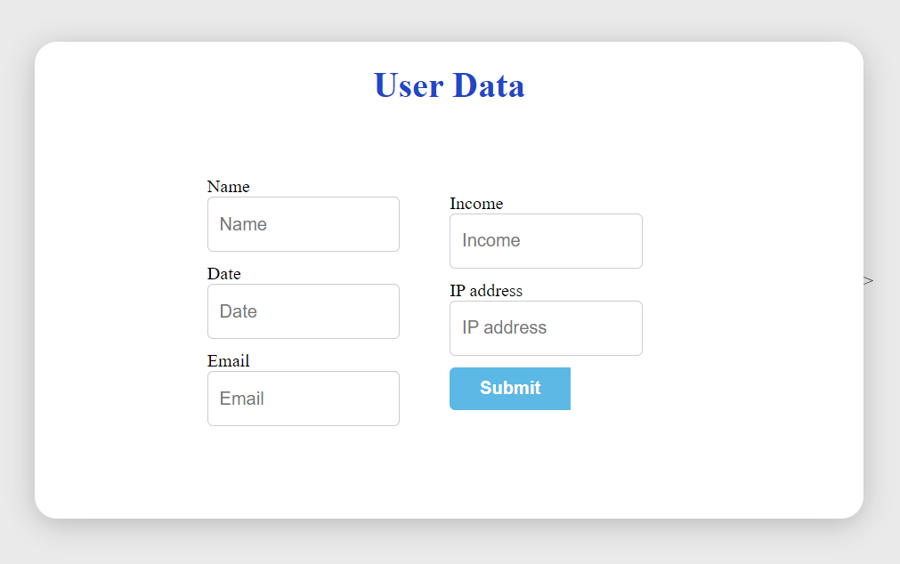
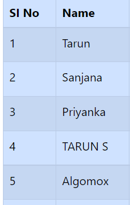

# Algomox Test

Created a UI in html/bootstrap to accept user data from a form and
display it in a table.

## Getting Started

1. First I Created a UI in html/css to accept user data from a form.
 

 
 
2. Then it validate The user data(Name and MailId)
 
 
2.1 Name is a required value and must be provided by user.
 

 
2.2 Email should contain only email type values.
 

 

 

3. Form Filling and Submit Button

 
 

4.After Posting this data to Server using a Post API here Im using Firebase and react js. This API should accept user data and append it to a file (contactform.json).
 
4.1 Firebase Interface(created project with name of Algomox test)
 

 
4.2 Creating a Realtime Database with read and write operation
 

 
4.3 it will Genatarte unique key for each submission
 

 

4.4 And the Data will Store like this in Json
 

 
4.5 We can also export this data in json file
 

 
5. Created a beautified UI for the user using React and added delete row functionality

 
5.1 created a react app and deployed using Netlify
 

 
6. Table column Sl No.(auto-generated).

 
7. Adding a row in the json file manually and it will auto-updated in UI within a sec without pressing the load button.
 
7.1 First Name is Tarun S
 

 
7.2 Removed S from json manually
 

 
7.3 manually removed char "S" is Updated on UI(S is removed)
 

 

## Demo
 
Project Link
 
Post UI: https://taruntechhub.github.io/Algomox.github.io/post/
 
Get UI:  https://stalwart-sable-5ce972.netlify.app/
 
source-code : https://github.com/TarunTechHub/Algomox.github.io

## Acknowledgements

 - [DevDocs API Documentation](https://devdocs.io/)
 - [React](https://reactjs.org/docs/create-a-new-react-app.html)
 - [React Bootstrap](https://react-bootstrap.github.io/)

